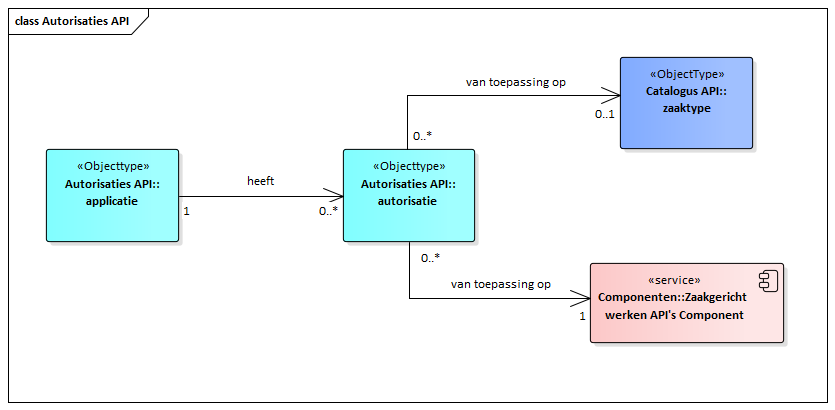

# Autorisaties API

API voor het beheren van autorisaties

Deze API laat toe om autorisaties van een (taak)applicatie te beheren en uit
te lezen.

De API ondersteunt de volgende operaties:

* Het toevoegen of wijzigen van een applicatie met client ids en van toegestane scopes
* Het ophalen van de toegestane scopes bij een bepaald client id
* Het verwijderen van een applicatie

## Gegevensmodel

## Specificatie van de Autorisaties API

* [Referentie-implementatie Autorisaties API](https://autorisaties-api.vng.cloud)
* API specificatie (OAS3) in
  [ReDoc][autorisaties-1.0.0-redoc],
  [Swagger][autorisaties-1.0.0-swagger],
  [YAML](https://autorisaties-api.vng.cloud/api/v1/schema/openapi.yaml) of
  [JSON](https://autorisaties-api.vng.cloud/api/v1/schema/openapi.json)

[autorisaties-1.0.0-redoc]: /gemma-zaken/content/standaard/autorisaties/redoc-1.0.0
[autorisaties-1.0.0-swagger]: /gemma-zaken/content/standaard/autorisaties/swagger-ui-1.0.0

## Specificatie van gedrag

Alle operaties beschreven in [`openapi.yaml`](https://autorisaties-api.vng.cloud/api/v1/schema/openapi.yaml) 
MOETEN ondersteund worden en tot hetzelfde resultaat leiden als de
referentie-implementatie van het AC.

Het is NIET TOEGESTAAN om gebruik te maken van operaties die niet beschreven
staan in deze OAS spec, of om uitbreidingen op operaties in welke vorm dan ook
toe te voegen.

#### Run-time gedrag

De AC MAG bij de registratie van autorisaties die een of meer zaaktypen
bevatten controleren of de zaaktypen bestaan. Merk op dat hiervoor het AC
zelf geautoriseerd moet zijn om het ZTC te bevragen.

##### **<a name="ac-001">Uniciteit van `client_ids` ([ac-001](#ac-001))</a>**

Een applicatie MAG zich met meerdere `client_id`s identificeren, waarbij er
een `client_id` per provider gebruikt wordt. Als eenmaal een `client_id` aan een
applicatie toegekend is, dan MAG dit `client_id` NIET opnieuw gebruikt worden.
Een `client_id` identifieert uniek 1 en slechts 1 applicatie.

##### **<a name="ac-002">Autorisatiesspecificatie ([ac-002](#ac-002))</a>**

Autorisaties MOETEN gespecifieerd worden op 1 van de volgende manieren:

* opvoeren van `Autorisatie`-objecten bij een `Applicatie`, waarbij de vlag
  `heeftAlleAutorisaties` `false` is
* het zetten van de vlag `heeftAlleAutorisaties` op `true`, waarbij er GEEN
  `Autorisatie`-objecten mogen opgevoerd worden

##### **<a name="ac-003">Verplichte velden voor Autorisaties ([ac-003](#ac-003))</a>**

Voor Autorisaties gelden regels voor verplichte velden op basis van `Autorisatie.component`:

* Voor `Autorisatie.component` == `zrc`:
    - Indien `Autorisatie.scopes` scopes bevat die betrekking hebben tot `zaken`, zijn de velden `Autorisatie.maxVertrouwelijkheidaanduiding` en `Autorisatie.zaaktype` verplicht
* Voor `Autorisatie.component` == `drc`:
    - Indien `Autorisatie.scopes` scopes bevat die betrekking hebben tot `documenten`, zijn de velden `Autorisatie.maxVertrouwelijkheidaanduiding` en `Autorisatie.informatieobjecttype` verplicht
* Voor `Autorisatie.component` == `brc`:
    - Indien `Autorisatie.scopes` scopes bevat die betrekking hebben tot `besluiten`, is het veld `Autorisatie.besluittype` verplicht

## Filter parameters

Componenten ondersteunen het filteren van gegevens op basis van parameters in
de querystring. Deze parameters MOETEN gevalideerd worden op het juiste
formaat, net zoals inputvalidatie plaatsvindt bij een `create` of `update`.

Indien de validatie faalt, dan MOET de API antwoorden met een HTTP 400
foutbericht, waarbij de `invalid-params` key meer informatie bevat over de fout.

Indien een parameter wordt toegepast die niet in de OAS van de betreffende API
staat, dan MOET de API antwoorden met een HTTP 400 foutbericht.

## Overige documentatie

* [Tutorial autorisatie](gemma-zaken/content/ontwikkelaars/handleidingen-en-tutorials/_assets/autorisatie.pptx)
