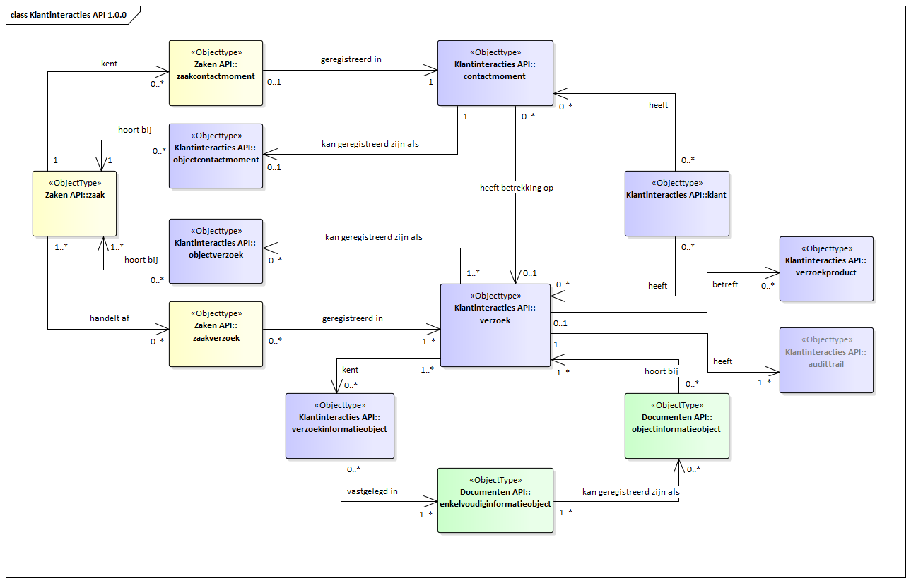

# Klantinteracties API

*Work in progress*

De Klantinteractie API ondersteunt het opslaan en ontsluiten van contactmomenten en verzoeken. De component slaat deze gestructureerd op en stelt applicaties in staat deze te wijzigen en te verwijderen.


## Gegevensmodel

He gegevensmodel modelleert zowel Contactmomenten als Verzoeken aangezien deze zijn opgenomen in één API.

[{:width="1200px"}](Klantinteracties API 1.0.0.png "Klantinteracties gegevensmodel - klik voor groot")

## Contactmomenten

Een contactmoment is een aaneengesloten periode waarbij interactief informatie wordt uitgewisseld tussen (minimaal) 2 partijen. Eén van deze partijen is daarbij een Medewerker van de gemeente of samenwerkingsverband en de andere partij is tenminste één Natuurlijk Persoon, eventueel in de rol van medewerker of vertegenwoordiger van (een Vestiging van) een Niet-Natuurlijk Persoon.  De gegevens van deze vertegenwoordiger worden in eerste instantie overgenomen  van de contactpersoon van de Vestiging uit het NHR. Deze mogen echter worden overschreven.

Voorbeelden van een Contactmoment zijn een baliebezoek en een telefonisch contact over een onderhanden zijnde Zaak. Twee telefoongesprekken over hetzelfde verzoek om informatie zijn 2 contactmomenten.
De Klantinteractie API bevat resources voor Klant, Contactmoment en Objectcontactmoment.

### Relaties met zaken en verzoeken

Een Contactmoment kan gekoppeld zijn aan één Zaak. Aan een zaak kunnen 0 of meer Contactmomenten gekoppeld worden. Dit wordt gerealiseerd via de resources Zaken API :: ZaakContactmoment en Contactmomenten API :: ObjectContactmoment, waarbij de resource ObjectContactmoment een duplicaat is van ZaakContactmoment. Dit is gelijk aan de werkwijze bij b.v. het koppelen van een Zaak aan een Besluit.

Een Contactmoment kan betrekking hebben op een Verzoek.

### Relatie met klanten

De Klant kan anoniem zijn wat betekent dat Klant een optionele relatie heeft met Contactmoment. Klanten kunnen natuurlijke personen en niet-natuurlijke personen zijn.


## Verzoeken

Een verzoek is een aanvraag of opdracht aan de gemeente (of andere overheid) voor de levering van een product of dienst. Verzoeken vormen dus de schakel tussen de klant, producten en diensten van de gemeente zoals in de PDC staan, en (evt.) het zaakgericht werken voor de afhandeling. Het concept verzoeken is voor het eerst geintroduceerd in GFO Zaken, maar had in het opvolgende informatiemodel RGBZ geen plaats. In de visie van VNG Realisatie is dat echter een omissie (redenen zijn hieronder gegeven), en daarom is er behoefte aan een concept dat vooraf gaat aan de daadwerkelijke behandeling in een zaak (of andere activiteit).

Met verzoeken introduceren we een nieuw concept in het zaakgericht werken wat niet betekent dat verzoeken niet ook gebruikt kunnen worden buiten het zaakgericht werken.

Zie: [Achtergrond informatie bij Verzoeken](/themas/achtergronddocumentatie/verzoeken)
 
### Relatie met zaken en informatieobjecten

Een verzoek kan resulteren in één of meerdere zaken of andere activiteiten (d.w.z. niet-zaakgericht), dan wel direct worden afgehandeld, bijvoorbeeld door levering van een informatiebrochure na aanvraag daarvan. Bovendien kan een verzoek worden gekoppeld aan een reeds lopende zaak.
 
Een verzoek kan bijlagen hebben in de vorm van informatieobjecten. Een informatieobject heeft altijd betrekking op slechts één verzoek. 
 
### Relatie met klanten

Net als bij Contactmomenten is de relatie met klanten optioneel. Denk bijv. aan een Melding Openbare Ruimte.


## Specificatie van de Klantinteracties API

* [Referentie-implementatie Klantinteracties API](https://klantinteracties-api.vng.cloud)
* API specificatie (OAS3) in
  [ReDoc](https://klantinteracties-api.vng.cloud/api/v1/schema/),
  [Swagger](https://petstore.swagger.io/?url=https://klantinteracties-api.vng.cloud/api/v1/schema/openapi.yaml),
  [YAML](https://klantinteracties-api.vng.cloud/api/v1/schema/openapi.yaml) of
  [JSON](https://klantinteracties-api.vng.cloud/api/v1/schema/openapi.json)


## Specificatie van gedrag

Klantinteractiecomponenten (KIC) MOETEN aan twee aspecten voldoen:

* de KIC `openapi.yaml` MOET volledig geïmplementeerd zijn.

* het run-time gedrag beschreven in deze standaard MOET correct geïmplementeerd
  zijn.

### OpenAPI specificatie

Alle operaties beschreven in [`openapi.yaml`](../../../api-specificatie/kic/1.0.x/openapi.yaml)
MOETEN ondersteund worden en tot hetzelfde resultaat leiden als de
referentie-implementatie van het KIC.

Het is NIET TOEGESTAAN om gebruik te maken van operaties die niet beschreven
staan in deze OAS spec, of om uitbreidingen op operaties in welke vorm dan ook
toe te voegen.

### Run-time gedrag

Bepaalde gedrageningen kunnen niet in een OAS spec uitgedrukt worden omdat ze
businesslogica bevatten. Deze gedragingen zijn hieronder beschreven en MOETEN
zoals beschreven geïmplementeerd worden.

#### **<a name="kic-001">Synchroniseren relaties met informatieobjecten ([kic-001](#kic-001))</a>**

Wanneer een relatie tussen een `INFORMATIEOBJECT` en een `VERZOEK` gemaakt
of bijgewerkt wordt, dan MOET het KIC in het DRC ook deze relatie
aanmaken/bijwerken.

Een voorbeeld:

1. Een informatieobject wordt gerelateerd aan een verzoek door een consumer:

    ```http
    POST https://kic.nl/api/v1/verzoekinformatieobjecten HTTP/1.0

    {
        "informatieobject": "https://drc.nl/api/v1/enkelvoudigeinformatieobjecten/1234",
        "verzoek": "https://kic.nl/api/v1/verzoek/456789"
    }
    ```

2. Het KIC MOET de relatie spiegelen in het DRC:

    ```http
    POST https://drc.nl/api/v1/objectinformatieobjecten HTTP/1.0

    {
        "informatieobject": "https://drc.nl/api/v1/enkelvoudigeinformatieobjecten/1234",
        "object": "https://kic.nl/api/v1/verzoeken/456789",
        "objectType": "verzoek",

    }
    ```

Merk op dat het aanmaken van de relatie niet gelimiteerd is tot het aanmaken
via de API. Indien elders (bijvoorbeeld via een admininterface) een relatie tot
stand kan komen, dan MOET deze ook gesynchroniseerd worden.

## Overige documentatie

* [Achtergrond informatie bij Verzoeken](/themas/achtergronddocumentatie/verzoeken)
