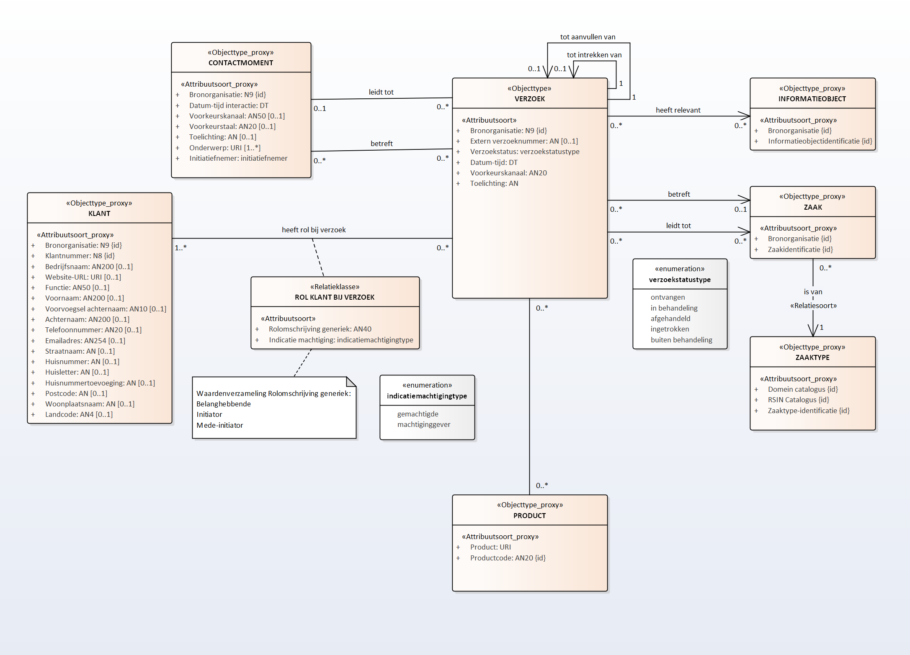
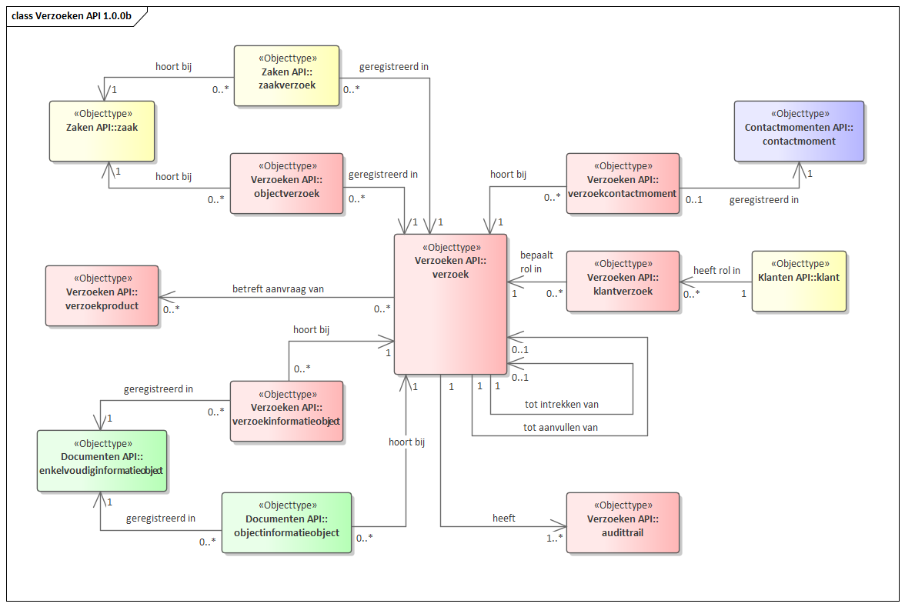

# Verzoeken API

API voor opslag en ontsluiting van verzoeken en daarbij behorende metadata.

De API ondersteunt het opslaan en het naar andere applicaties ontsluiten van gegevens over verzoeken. 

Deze API ondersteunt het verwerken van gegevens van verzoeken inclusief de relatie met eventuele za(a)k(en), informatieobject(en), klant(en) en/of contactmoment(en).

Een verzoek is een aanvraag of opdracht aan de gemeente (of andere overheid) voor de levering van een product of dienst. Verzoeken vormen dus de schakel tussen de klant, producten en diensten van de gemeente zoals in de PDC staan, en (evt.) het zaakgericht werken voor de afhandeling. Het concept verzoeken is voor het eerst geintroduceerd in GFO Zaken, maar had in het opvolgende informatiemodel RGBZ geen plaats. In de visie van VNG Realisatie is dat echter een omissie (redenen zijn hieronder gegeven), en daarom is er behoefte aan een concept dat vooraf gaat aan de daadwerkelijke behandeling in een zaak (of andere activiteit).

Met verzoeken introduceren we een nieuw concept in het zaakgericht werken wat niet betekent dat verzoeken niet ook gebruikt kunnen worden buiten het zaakgericht werken.

De verzoeken API bevat resources voor verzoek, klantverzoek, verzoekcontactmoment, verzoekinformatieobject, verzoekproduct en objectverzoek.

Zie: [Achtergrond informatie bij Verzoeken](/themas/achtergronddocumentatie/verzoeken)

# Informatie- en gegevensmodel

Zoals hierboven vermeld bevat RGBZ geen resource/objecttype voor Verzoeken. Omdat de Verzoeken API is opgezet in de bredere context van Klantinteractie, is voor dit domein een aanvullend informatiemodel gemaakt. 

[{:width="1200px"}](IM Verzoeken.png "Informatiemodel Verzoeken - klik voor groot")

Het gegevensmodel is een weergave van de implementatie van het informatiemodel in de API specificatie.

[{:width="1200px"}](Verzoeken API 1.0.0b.png "Verzoeken gegevensmodel - klik voor groot")

## Relatie met klanten

Een klant kan een rol hebben bij een verzoek. Vooralsnog zijn deze rollen `Belanghebbende`, `Initiator` en `Mede-initiator`. De relatie tussen klant en verzoek is vastgelegd in `klantverzoek` in de verzoeken API.

## Relatie met contactmomenten

Een contactmoment kan leiden tot één of meer verzoeken. Daarnaast kan een contactmoment betrekking hebben op één of meer verzoeken en bij één verzoek kunnen één of meer contactmomenten geregistreerd zijn. Deze relatie is vastgelegd in `verzoekcontactmoment` (Verzoeken API).

## Relatie met zaken

Een verzoek kan leiden tot één of meer zaken. Daarnaast kan een verzoek betrekking hebben op één of meer zaken en in één zaak kunnen één of meer verzoeken afgehandeld worden. Deze relatie is vastgelegd in `zaakverzoek` (Zaken API) en `objectverzoek` (Verzoeken API).

## Relatie met informatieobjecten

Bij een verzoek kunnen één of meer informatieobject(en) geregistreerd zijn. En een informatieobject kan bij één of meer verzoeken en rol spelen. deze relatie is vastgelegd in `verzoekinformatieobject` (Verzoeken API) en `objectinformatieobject` (Documenten API).

## Relatie met verzoeken

Een Verzoek kan gerelateerd zijn aan een ander Verzoek in de vorm van een aanvulling op een eerder Verzoek of het intrekken van een Verzoek. Dit is vastgelegd in de attributen `aangevuldeVerzoek`, `aanvullendVerzoek`, `inTeTrekkenVerzoek`, `intrekkendeVerzoek`.

## Specificatie van de Contactmomenten API

* [Referentie-implementatie Verzoeken API](https://verzoeken-api.vng.cloud)
* API specificatie (OAS3) in
  [ReDoc][verzoeken-1.0.0-redoc],
  [Swagger][verzoeken-1.0.0-swagger],
  [YAML](https://verzoeken-api.vng.cloud/api/v1/schema/openapi.yaml) of
  [JSON](https://verzoeken-api.vng.cloud/api/v1/schema/openapi.json)

[verzoeken-1.0.0-redoc]: /gemma-zaken/content/standaard/verzoeken/redoc-1.0.0
[verzoeken-1.0.0-swagger]: /gemma-zaken/content/standaard/verzoeken/swagger-ui-1.0.0

# Specificatie van gedrag

De Verzoeken API MOET aan twee aspecten voldoen:

* de OAS-specificatie `openapi.yaml` MOET volledig geïmplementeerd zijn.

* het run-time gedrag hieronder beschreven MOET correct geïmplementeerd zijn.

## OpenAPI specificatie

Alle operaties beschreven in [openapi.yaml](https://verzoeken-api.vng.cloud/api/v1/schema/openapi.yaml) MOETEN ondersteund worden en tot hetzelfde resultaat leiden als de referentie-implementatie van de VRC.

Het is NIET TOEGESTAAN om gebruik te maken van operaties die niet beschreven staan in deze OAS spec, of om uitbreidingen op operaties in welke vorm dan ook toe te voegen.

## Run-time gedrag

Bepaalde gedrageningen kunnen niet in een OAS spec uitgedrukt worden omdat ze businesslogica bevatten. Deze gedragingen zijn hieronder beschreven en MOETEN zoals beschreven geïmplementeerd worden.

### **<a name="vrz-001">Garanderen uniciteit `bronorganisatie` en `identificatie` in de `Verzoek`-resource ([vrz-001](#vrz-001))</a>**

Bij het aanmaken (`verzoek_create`) en bijwerken (`verzoek_update` en `verzoek_partial_update`) van een verzoek MOET gevalideerd worden dat de combinatie `identificatie` en `bronorganisatie` uniek is, indien de `identificatie` door de consumer meegestuurd wordt.

Indien de identificatie niet door de consumer gestuurd wordt, dan MOET de Verzoeken API de identificatie genereren op een manier die garandeert dat de identificatie uniek is binnen de bronorganisatie.

### **<a name="vrz-002">Automatisch zetten van het attribuut `intrekkendeVerzoek`([vrz-002](#vrz-002))</a>**

Bij het aanmaken (`verzoek_create`) en bijwerken (`verzoek_update` en `verzoek_partial_update`) van een VERZOEK MOET op basis van het veld `inTeTrekkenVerzoek` het veld `intrekkendeVerzoek` van het VERZOEK dat is ingetrokken automatisch worden aangepast zodat er een kruisverwijzing ontstaat.

### **<a name="vrz-003">Automatisch zetten van het attribuut `aanvullendeVerzoek`([vrz-003](#vrz-003))</a>**

Bij het aanmaken (`verzoek_create`) en bijwerken (`verzoek_update` en `verzoek_partial_update`) van een VERZOEK MOET op basis van het veld `aangevuldeVerzoek` het veld `aanvullendeVerzoek` van het VERZOEK dat is aangevuld worden aangepast zodat er een kruisverwijzing ontstaat.

### **<a name="vrz-004">Valideren attributen `klant`, `verzoek` en `rol` bij aanmaken van een KLANT-VERZOEK relatie ([vrz-004](#vrz-004))</a>**

Bij het aanmaken van een KLANT-VERZOEK-relatie (`klantverzoek_create`) MOETEN de URL-referenties naar KLANT en VERZOEK gevalideerd worden op het bestaan. Indien het ophalen van de objecten niet (uiteindelijk) resulteert in een `HTTP 200` status code, MOET er geantwoord worden met een `HTTP 400` foutbericht. Bovendien MOET de combinatie `klant`, `verzoek` en `rol` uniek zijn. Als dit niet het geval is, MOET er geantwoord worden met een `HTTP 400` foutbericht.

### **<a name="vrz-005">Valideren attributen `verzoek` en `contactmoment` bij aanmaken van een VERZOEK-CONTACTMOMENT relatie ([vrz-005](#vrz-005))</a>**

Bij het aanmaken van een VERZOEK-CONTACTMOMENT-relatie (`verzoekcontactmoment_create`) MOETEN de URL-referenties naar VERZOEK en CONTACTMOMENT gevalideerd worden op het bestaan. Indien het ophalen van de objecten niet (uiteindelijk) resulteert in een `HTTP 200` status code, MOET er geantwoord worden met een `HTTP 400` foutbericht. Bovendien MOET de combinatie `verzoek` en `contactmoment` uniek zijn. Als dit niet het geval is, MOET er geantwoord worden met een `HTTP 400` foutbericht.

### **<a name="vrz-006">Valideren attributen `verzoek` en `informatieobject` bij aanmaken van een VERZOEK-INFORMATIEOBJECT relatie ([vrz-006](#vrz-006))</a>**

Bij het aanmaken van een VERZOEK-INFORMATIEOBJECT relatie (`verzoekinformatieobject_create`) MOETEN de URL-referenties naar VERZOEK en INFORMATIEOBJECT gevalideerd worden op het bestaan. Indien het ophalen van de objecten niet (uiteindelijk) resulteert in een `HTTP 200` status code, MOET er geantwoord worden met een `HTTP 400` foutbericht. Bovendien MOET de combinatie `verzoek` en `INFORMATIEOBJECT` uniek zijn. Als dit niet het geval is, MOET er geantwoord worden met een `HTTP 400` foutbericht.

### **<a name="vrz-007">Valideren attributen `verzoek`, `product` en `productIdentificatie.code` bij aanmaken van een VERZOEK-PRODUCT relatie ([vrz-007](#vrz-007))</a>**

Bij het aanmaken van een VERZOEK-PRODUCT relatie (`verzoekproduct_create`) MOETEN de URL-referenties naar VERZOEK en PRODUCT indien niet gelijk aan `null` gevalideerd worden op het bestaan. Indien het ophalen van de objecten niet (uiteindelijk) resulteert in een `HTTP 200` status code, MOET er geantwoord worden met een `HTTP 400` foutbericht. Bovendien MOET de combinatie `verzoek` en `product` of de combinatie `verzoek` en `productIdentificatie.code` uniek zijn. Als dit niet het geval is, MOET er geantwoord worden met een `HTTP 400` foutbericht.

### **<a name="vrz-008">Valideren attributen `verzoek`, `object` en `objectType` bij aanmaken van een OBJECT-VERZOEK relatie ([vrz-008](#vrz-008))</a>**

Bij het aanmaken van een OBJECT-VERZOEK relatie (`objectverzoek_create`) MOETEN de URL-referenties naar OBJECT en VERZOEK gevalideerd worden op het bestaan. Indien het ophalen van de objecten niet (uiteindelijk) resulteert in een `HTTP 200` status code, MOET er geantwoord worden met een `HTTP 400` foutbericht. Bovendien MOET de combinatie `object` en `verzoek` uniek zijn. Als dit niet het geval is, MOET er geantwoord worden met een `HTTP 400` foutbericht.

### **<a name="vrz-009">Valideren bestaan relatie tussen OBJECT en VERZOEK in de bron ([vrz-009](#vrz-009))</a>**

Er MOET gevalideerd worden dat de relatie tussen het OBJECT en het VERZOEK al bestaat in de bron van het OBJECT. De bron van het OBJECT is bekend door de eerdere validaties op deze URL. 

### HTTP-Caching

De Verzoeken API moet HTTP-Caching ondersteunen op basis van de `ETag` header. In de API spec staat beschreven voor welke resources dit van toepassing is.

De `ETag` MOET worden berekend op de JSON-weergave van de resource. Verschillende, maar equivalente weergaves (bijvoorbeeld dezelfde API ontsloten wel/niet via NLX) MOETEN verschillende waarden voor de `ETag` hebben.

Indien de consumer een `HEAD` verzoek uitvoert op deze resources, dan MOET de provider antwoorden met dezelfde headers als bij een normale `GET`, dus inclusief de `ETag` header. Er MAG GEEN response body voorkomen.

Indien de consumer gebruik maakt van de `If-None-Match` header, met één of meerdere waarden voor de `ETag`, dan MOET de provider antwoorden met een `HTTP 304` bericht indien de huidige `ETag` waarde van de resource hierin voorkomt. Als de huidige `ETag` waarde hier niet in voorkomt, dan MOET de provider een normale `HTTP 200` response sturen.
